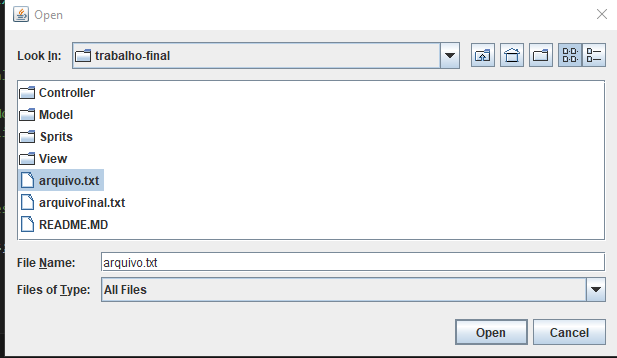
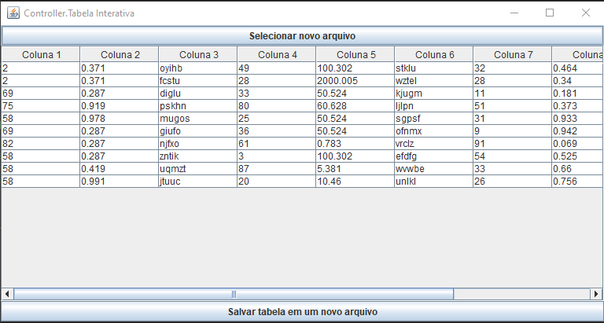
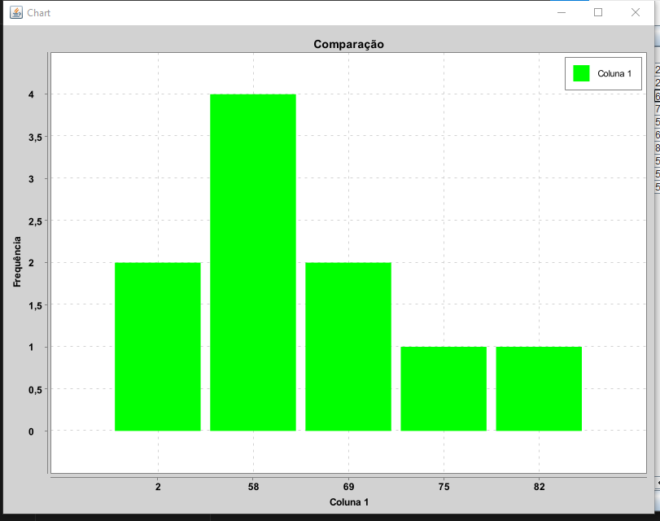
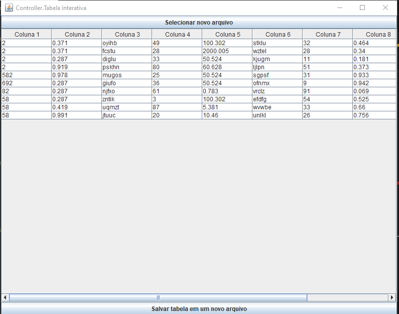
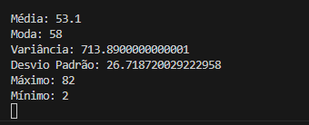

## **Universidade Federal do Ceará** | **Departamento de Computação**
### **Disciplina: Técnicas de programação 1 – CK0235** | **Professor: Jose Antonio Fernandes De Macedo**

**TRABALHO FINAL**

Cada grupo deverá escolher um dos temas abaixo para desenvolver uma aplicação completa (sem bugs ou funcionalidades faltando).

**Tema 5:​ Plotar distribuição a dados e medidas descritivas estatísticas dos dados**

O programa deve ser capaz de ler um arquivo contendo uma tabela de dados (inteiros, float ou String). A primeira linha deste arquivo deve conter os nomes das colunas da tabela. Após a leitura do arquivo, o programa deverá apresentar a tabela ao usuário e permitir que o usuário escolha uma coluna para visualizar um gráfico com a distribuição dos dados dessa coluna. Além disso, o programa deverá exibir a média, moda, variância, desvio padrão, valor máximo e valor mínimo dos valores da coluna selecionada. O usuário também poderá modificar os dados da tabela apresentada e salvá-la novamente em um arquivo.

- O arquivo de entrada é arquivo.txt, que contém uma tabela de valores para teste.
- Após selecionado a tabela, os valores são printados.
- Após o usuario escolher uma coluna, um grafico é gerado.
- O usuário pode alterar os valores de qualquer célula do programa.
- A parti de uma coluna selecionada, extrair média,mediana, moda, variança, desvio padrão, min e max 
- Botão para salvar arquivo.
- Botão para ler um novo arquivo.

